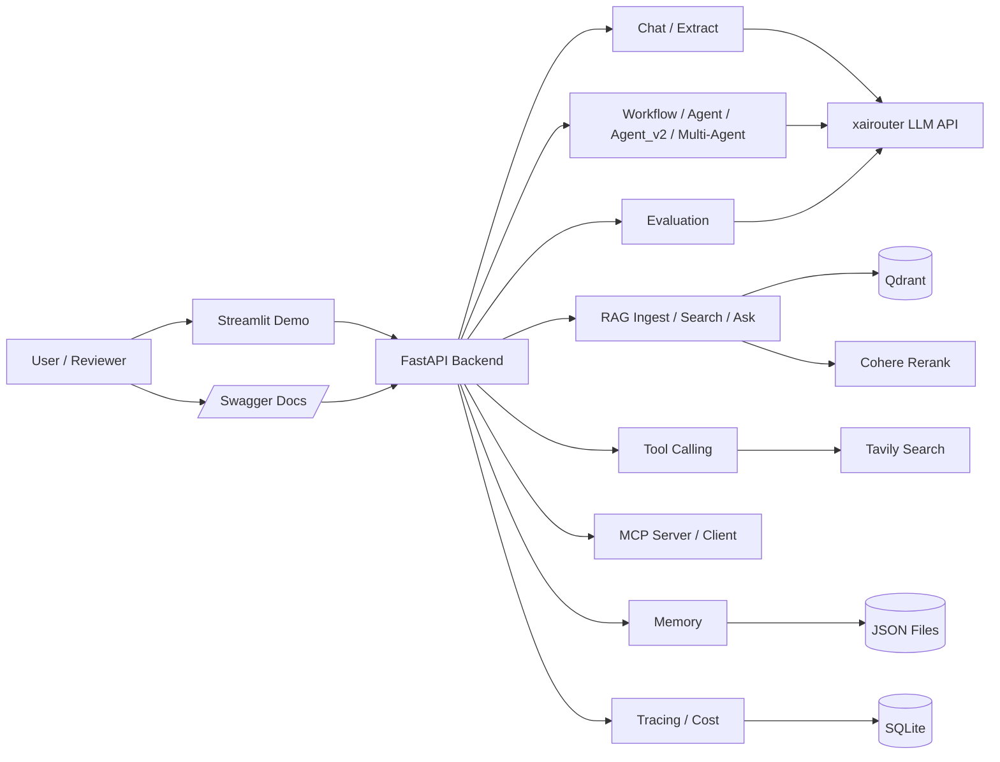

# Research Agent Platform

一个从零搭到可演示、可评审、可部署的研究助手项目。它把聊天、RAG、工具调用、研究流程、记忆、多 Agent、MCP、评估、安全和可观测性放在同一个 FastAPI 后端里，并补了前端演示、Docker Compose 和 CI。

## 架构图



## 已实现能力

| Phase | 内容 |
|------|------|
| Phase 0 | Python 工程基础、配置、日志、测试 |
| Phase 1 | `/chat`、`/extract`、Prompt Service |
| Phase 2 | RAG：入库、检索、问答、评估脚本 |
| Phase 3 | Tool Use：工具注册表、工具循环、`/tools/*` |
| Phase 4 | Workflow / Agent 研究流 |
| Phase 5 | Memory、Planning、Reflection、Multi-Agent |
| Phase 6 | MCP Server / Client 集成 |
| Phase 7 | Evaluation、Guardrails、Observability |
| Phase 8 | Streaming、Docker Compose、Streamlit 前端、CI、文档增强 |

## 全新 redesign 项目

新的 clean-room 学习型 Agent 工程版本位于 `redesign/`。它从 Phase 0 scaffold 开始，采用 `packages/research_core` 共享核心、课程/产品双层结构，并默认离线可测试。

入口文档：

- `redesign/README.md`
- `redesign/docs/README.md`
- `redesign/docs/plans/2026-06-25-redesign-execution-roadmap.md`

## 快速开始

### 本地启动

1. 准备 Python 3.11 环境。

```powershell
conda activate ai-agent
```

2. 安装后端依赖。

```powershell
pip install -r requirements.txt -i https://pypi.tuna.tsinghua.edu.cn/simple
```

3. 复制环境变量模板。

```powershell
Copy-Item .env.example .env
```

RAG 需要可用的 embedding 接口。`EMBEDDING_API_KEY` 和 `EMBEDDING_BASE_URL` 留空时，会复用主模型接口；只有当你的主模型服务也支持 `/embeddings` 时，这样才可以正常入库。

4. 启动 Qdrant。

```powershell
docker run -d --name qdrant -p 6333:6333 -p 6334:6334 qdrant/qdrant:v1.11.3
```

如果容器已经存在：

```powershell
docker start qdrant
```

5. 启动后端。

```powershell
uvicorn app.main:app --host 127.0.0.1 --port 8000
```

6. 可选：启动前端演示。

```powershell
pip install -r frontend/requirements.txt -i https://pypi.tuna.tsinghua.edu.cn/simple
streamlit run frontend/app.py
```

访问地址：

- 后端文档：`http://127.0.0.1:8000/docs`
- 前端演示：`http://127.0.0.1:8501`

### Docker 一键启动

```powershell
docker compose up --build
```

启动后：

- Qdrant：`http://127.0.0.1:6333`
- 后端：`http://127.0.0.1:8000`
- 前端：`http://127.0.0.1:8501`

## API 概览

| 方法 | 路径 | 功能 |
|------|------|------|
| GET | `/health` | 健康检查 |
| POST | `/api/v1/chat` | 普通聊天 |
| POST | `/api/v1/chat/stream` | 流式聊天 |
| POST | `/api/v1/extract` | 文本提取 |
| POST | `/api/v1/rag/ingest` | 文件入库 |
| POST | `/api/v1/rag/search` | 向量检索 |
| POST | `/api/v1/rag/ask` | 基于证据回答 |
| GET | `/api/v1/tools/list` | 查看可用工具 |
| POST | `/api/v1/tools/chat` | 带工具对话 |
| POST | `/api/v1/research` | 研究任务执行 |
| GET / DELETE | `/api/v1/memory/*` | 记忆查看与清理 |
| GET / POST | `/api/v1/mcp/*` | MCP 查看与调试 |
| POST / GET | `/api/v1/eval/*` | 评估 |
| GET | `/api/v1/observability/*` | 追踪与成本 |

## 4 种 research mode 对比

| 模式 | 适合什么 | 特点 |
|------|------|------|
| `workflow` | 最稳定的固定流程 | 重写查询 -> 搜索 -> 出报告 |
| `agent` | 需要多轮搜索 | 会判断信息够不够，不够就继续搜 |
| `agent_v2` | 需要更完整的单 Agent 能力 | 多了记忆、计划、自检和修订 |
| `multi_agent` | 展示角色分工 | Planner / Researcher / Analyst / Writer / Reviewer 协作 |

## 评估怎么跑

RAG 评估：

```powershell
python -m scripts.run_rag_eval --cases eval/rag_questions.jsonl --limit 5 --with-llm-judge
```

Agent 评估：

```powershell
python -m scripts.run_agent_eval --mode agent_v2 --limit 5
```

评估结果会写到 `eval/results/`。

## 测试怎么跑

全量自动测试：

```powershell
python -m pytest -q
```

MCP 自连 smoke：

```powershell
python -m scripts.smoke_test_mcp
```

评估与观测 smoke：

```powershell
python -m scripts.smoke_test_eval --base-url http://127.0.0.1:8000
```

## 项目结构

```text
8w-plan/
├── app/                 # FastAPI 后端
├── frontend/            # Streamlit 演示前端
├── tests/               # 自动测试
├── eval/                # 评估数据与结果
├── scripts/             # 脚本与 smoke test
├── data/                # 本地数据、记忆、追踪
├── docs/superpowers/    # 设计、计划、过程记录
├── redesign/            # clean-room redesign 课程/产品双层项目
├── Dockerfile
├── docker-compose.yml
└── .github/workflows/   # CI
```

## 技术决策说明

### 为什么不用 `langchain-openai`

这个项目刻意保留底层调用细节，所有大模型请求都走自己写的 `LLMService + httpx`。这样更容易看清楚请求结构、错误处理、流式返回、埋点和成本统计到底放在哪。

### 为什么用 LangGraph，但不用 LangChain 的大模型封装

这里用 LangGraph 只是为了做状态图编排，不是为了把模型调用也交给黑盒。这样既能学到图式编排，又不会把最关键的 LLM 调用层藏起来。

### 为什么 Memory 用 JSON，不用 Redis

这是教学型项目，先把“记忆分层”和“读写时机”讲清楚更重要。JSON 文件足够演示短期记忆、长期记忆和会话复用，外部依赖也更少。

### 为什么 Guardrails 用规则，不用 NeMo

第一道防线要便宜、快、可解释。规则匹配虽然简单，但能稳稳挡住一批明显风险。更重的方案可以放到扩展阶段，不必在学习项目里先把复杂度拉满。

## 生产化说明

- `POST /api/v1/mcp/tools/{tool_name}/invoke` 只是本地调试入口，不应该直接暴露到公网。
- `API_KEY_REQUIRED=true` 时，会对 `/tools`、`/research`、`/memory` 启用简单的请求头保护。
- Cohere 重排在外部服务不可用时会自动降级，不会把整条 RAG 链路直接拖死。

## License

仅供学习和演示使用。需要对外发布时，请按你的实际需求补充正式许可证。

## 致谢

- FastAPI
- LangGraph
- Qdrant
- MCP Python SDK
- Streamlit
