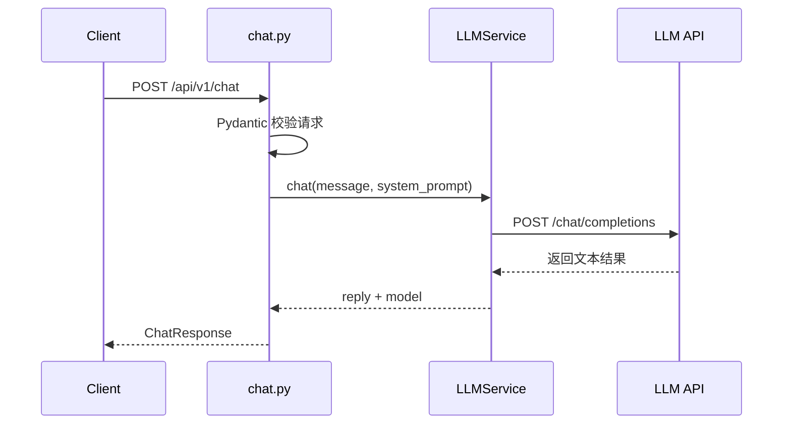
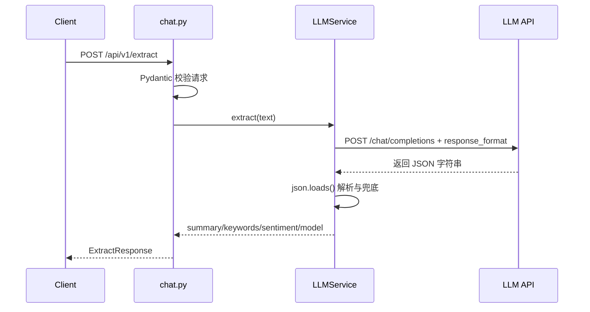
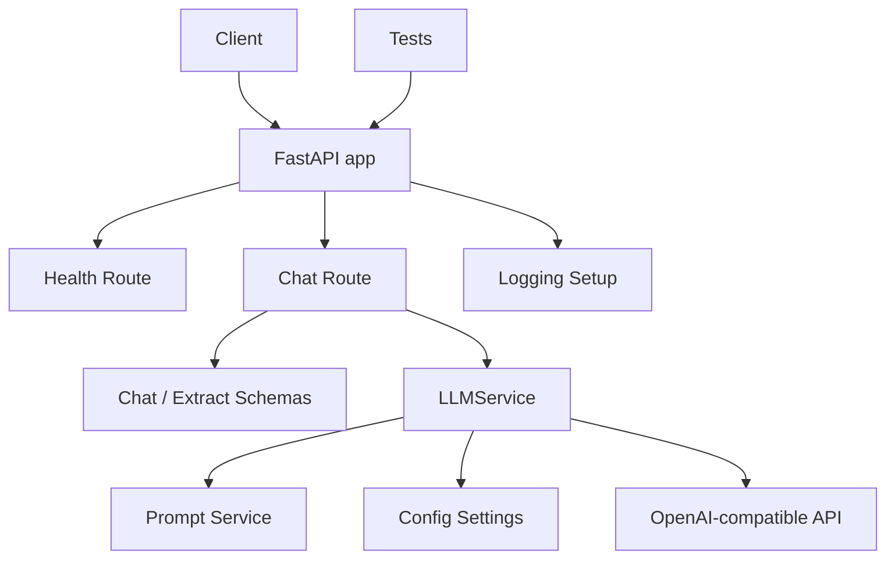

# Phase 0 + Phase 1 架构文档

## 1. 当前阶段的系统目标

本阶段的系统目标不是构建完整 Agent，而是搭建一个可运行、可理解、可扩展的最小后端骨架，用来承载：

- 基础 API 服务
- LLM 调用
- 结构化输出
- 后续 RAG / Tool Use / Agent 的扩展入口

## 2. 当前阶段的架构概览

本阶段采用典型的分层后端结构：

- **入口层**：FastAPI app 启动与路由注册
- **接口层**：对外暴露 HTTP API
- **Schema 层**：定义请求/响应数据结构
- **Service 层**：封装 LLM 调用和业务逻辑
- **Core 层**：处理配置与日志
- **测试层**：最小测试与接口验证

## 3. 模块划分

### 3.1 `app/main.py`

职责：
- 创建 FastAPI 应用
- 注册路由
- 提供根路径

为什么存在：
- 所有应用都需要一个统一入口，后续中间件、生命周期钩子、全局异常处理都会在这里继续扩展。

### 3.2 `app/core/config.py`

职责：
- 从 `.env` 读取配置
- 提供全局 `Settings`

为什么存在：
- 把配置从代码中分离，方便切换环境、模型供应商和部署方式。

### 3.3 `app/core/logging.py`

职责：
- 初始化日志格式和日志级别

为什么存在：
- 当前阶段日志需求很基础，但后续 tracing、错误分析、性能统计都依赖日志基础设施。

### 3.4 `app/schemas/chat.py`

职责：
- 定义聊天接口和结构化提取接口的请求/响应 schema

为什么存在：
- 让接口具备明确的数据契约，便于验证输入、约束输出、生成文档。

### 3.5 `app/api/routes/health.py`

职责：
- 提供健康检查接口

为什么存在：
- 健康检查是服务化系统的基础能力，后续上线、部署、监控都要依赖这个接口。

### 3.6 `app/api/routes/chat.py`

职责：
- 提供 `/api/v1/chat`
- 提供 `/api/v1/extract`
- 调用 service 层完成业务处理

为什么存在：
- route 层是对外 API 的边界，应该足够轻，不承载复杂业务逻辑。

### 3.7 `app/services/prompt_service.py`

职责：
- 管理当前阶段的系统 prompt

为什么存在：
- prompt 是可维护资产，不应该散落在业务逻辑中。现在先做最小分离，后续容易扩展成 prompt registry。

### 3.8 `app/services/llm_service.py`

职责：
- 封装 LLM API 调用
- 统一处理请求 payload
- 处理结构化提取逻辑
- 对模型返回 JSON 做最小兜底处理

为什么存在：
- 这是当前阶段最核心的业务模块。后续要扩展重试、超时、缓存、RAG、Tool Use，都会围绕这里演进。

### 3.9 `tests/`

职责：
- 对健康检查和结构化接口进行最小测试

为什么存在：
- 让你从一开始就建立“代码不是只要能跑，还要能验证”的工程习惯。

## 4. 各文件职责说明

```bash
8w-plan/
├─ app/
│  ├─ main.py                    # 应用入口
│  ├─ api/routes/health.py       # 健康检查接口
│  ├─ api/routes/chat.py         # 聊天与结构化提取接口
│  ├─ api/routes/rag.py          # RAG 端点（Phase 2）
│  ├─ core/config.py             # 配置管理
│  ├─ core/logging.py            # 日志初始化
│  ├─ schemas/chat.py            # 请求/响应 schema
│  ├─ schemas/rag.py             # RAG schema（Phase 2）
│  ├─ services/prompt_service.py # Prompt 定义
│  ├─ services/llm_service.py    # LLM 调用与业务逻辑
│  └─ services/...               # RAG 相关服务（Phase 2，详见 phase2_architecture.md）
├─ tests/test_health.py          # 健康检查测试
├─ tests/test_extract.py         # 结构化提取测试
├─ tests/test_*.py               # RAG 相关测试（Phase 2）
├─ scripts/                      # 评估脚本（Phase 2）
├─ eval/                         # 评估数据（Phase 2）
├─ study_docs/                   # 学习文档
├─ excut_docs/                   # 执行文档
├─ architecture_docs/            # 架构文档
├─ .env.example                  # 示例配置
├─ requirements.txt              # 依赖清单
├─ pytest.ini                    # pytest 配置
└─ README.md                     # 当前阶段说明
```

## 5. 数据流 / 调用链说明

### 5.1 `/api/v1/chat` 调用链



### 5.2 `/api/v1/extract` 调用链



## 6. 配置与依赖关系

当前阶段主要依赖：

- `FastAPI`：提供 API 框架
- `Pydantic`：定义 schema 和配置模型
- `pydantic-settings`：从 `.env` 读取配置
- `httpx`：向模型接口发送 HTTP 请求
- `pytest`：执行测试

配置来源：

- `.env`
- `app/core/config.py`

依赖方向：

```text
main.py
  -> routes
    -> schemas
    -> services
      -> prompt_service
      -> config
```

这个依赖方向比较干净：

- route 不依赖 route
- schema 不依赖 service
- service 可依赖 config 和 prompt
- main 作为应用装配层依赖各组件

## 7. 为什么这样设计

### 设计原因 1：先保证最小工程结构成立

当前阶段最重要的是把基础结构搭正确，而不是追求功能多。因为后续所有阶段都会在这套结构上继续加东西。

### 设计原因 2：让“学习”与“工程”同时成立

如果结构太简单，你学不到真实工程习惯；如果结构太复杂，你又很难理解。所以当前设计刻意控制在：

- 文件数量不多
- 职责分工清楚
- 扩展点明确

### 设计原因 3：为后续阶段预留扩展能力

当前 service 层已经可以自然扩展：

- 新增 RAG service
- 新增 vector store config
- 新增 tool registry
- 新增 workflow orchestration

这就是“当前阶段代码能作为下一阶段基础”的核心。

## 8. 当前设计的边界

Phase 0+1 **故意不做**这些事情（部分已在后续阶段实现）：

- 不接数据库
- 不做会话持久化
- ~~不做 RAG~~ → **Phase 2 已实现**（详见 `architecture_docs/phase2_architecture.md`）
- 不做 tool calling（Phase 3 计划）
- 不做 workflow / agent loop（Phase 4+ 计划）
- 不做前端页面
- 不做复杂认证与权限控制

这是有意控制范围，不是缺失。

## 9. 为下一阶段预留的扩展点

### 扩展点 1：`services/`

已扩展（Phase 2）：

- `document_parser_service.py`、`chunking_service.py`、`embedding_service.py`
- `vector_store_service.py`、`retrieval_service.py`、`rerank_service.py`
- `rag_service.py`、`evaluation_service.py`

后续可新增（Phase 3+）：

- `tool_registry.py`
- `function_call_service.py`
- `workflow_service.py`

### 扩展点 2：`schemas/`

已扩展（Phase 2）：`rag.py`

后续可新增：

- `tool.py`
- `workflow.py`

### 扩展点 3：`api/routes/`

已扩展（Phase 2）：`rag.py`

后续可新增：

- `tools.py`
- `workflow.py`

### 扩展点 4：`core/config.py`

已扩展（Phase 2）：Embedding / Qdrant / Rerank / RAG 行为配置

后续可新增：

- 数据库配置
- tracing 配置
- 缓存配置

## 10. 当前阶段的整体架构图



这张图对应当前阶段的真实结构，也说明了这套项目为什么适合作为后续更大系统的起点。
