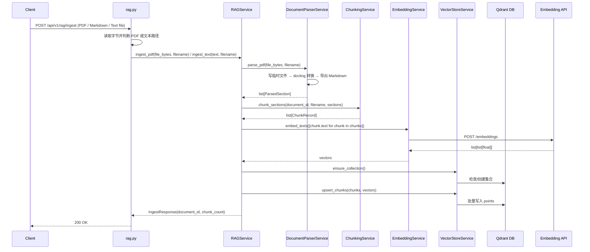
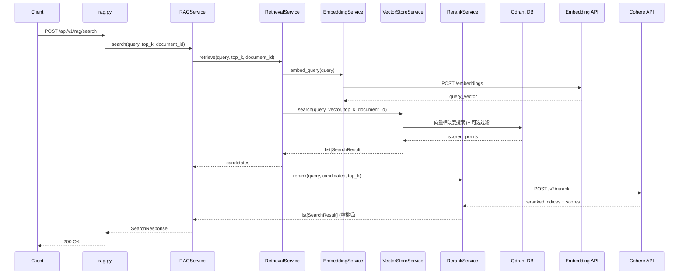
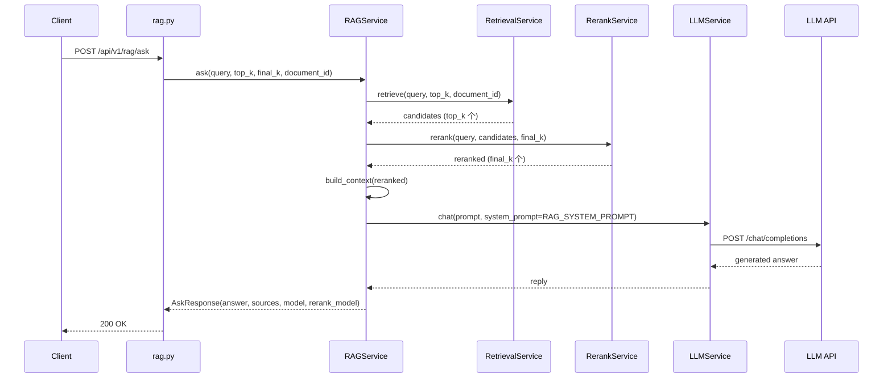
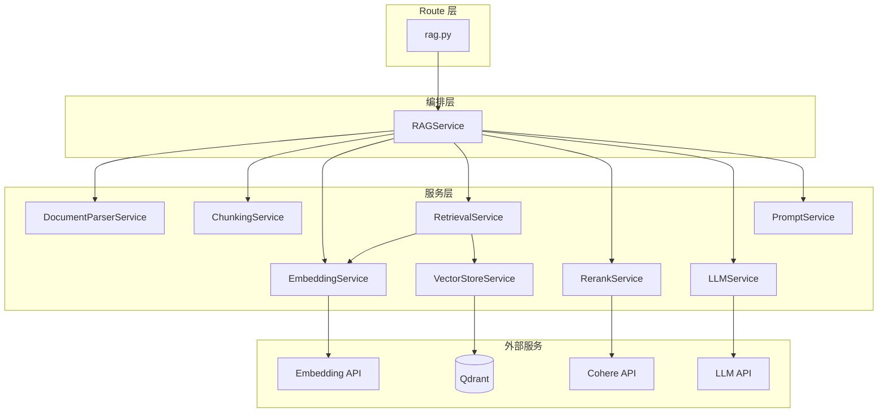
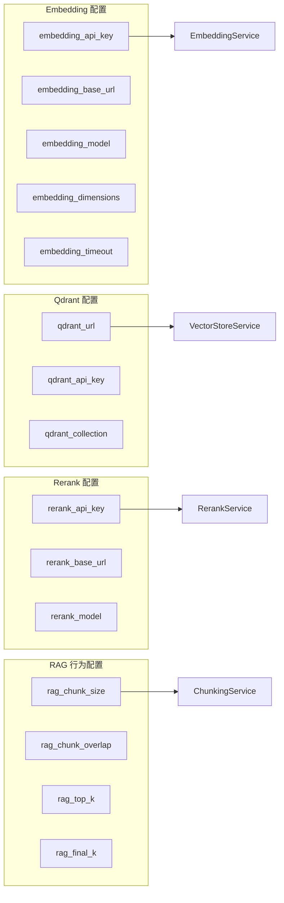
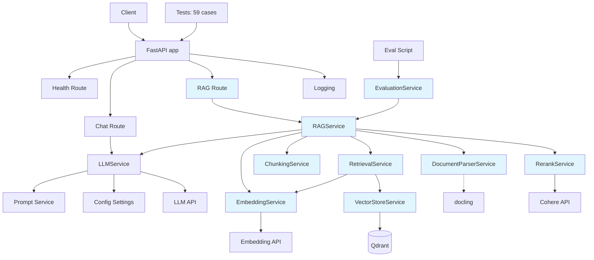

# Phase 2 RAG 系统架构文档

## 1. 系统目标

Phase 2 在 Phase 0+1 的基础上增加了完整的 RAG 能力：

- 上传 PDF / Markdown / 纯文本文档并进入索引流程
- 分块 → 向量化 → 存入向量数据库
- 语义检索 + Reranking 精排
- 基于检索结果的 LLM 回答（带来源引用）
- 最小评估框架

系统从"纯聊天后端"升级为"能基于私有文档回答问题的 RAG 后端"。

## 2. Phase 2 架构概览

Phase 2 新增了以下层次：

- **Route 层**：新增 `rag.py`，3 个端点
- **Schema 层**：新增 `rag.py`，7 个数据模型
- **Service 层**：新增 7 个服务（解析、分块、向量化、向量存储、检索、精排、编排）
- **评估层**：新增评估服务 + 评估脚本 + 评估数据
- **外部依赖**：Qdrant 向量数据库、Embedding API、Cohere Rerank API

## 3. 模块划分（Phase 2 新增）

### 3.1 `app/schemas/rag.py`

职责：
- 定义 RAG 相关的所有请求/响应模型

模型清单：
- `ParsedSection`：文档解析后的节段（text + page_number + section_title）
- `ChunkRecord`：分块记录（chunk_id + document_id + text + 元数据）
- `SearchRequest` / `SearchResult` / `SearchResponse`：搜索请求和响应
- `AskRequest` / `AskResponse`：问答请求和响应
- `IngestResponse`：文档入库响应

设计要点：
- `AskRequest` 使用 `@model_validator` 校验 `final_k <= top_k`
- `SearchResult` 同时作为内部传递对象和 API 返回结构

### 3.2 `app/services/document_parser_service.py`

职责：
- 将 PDF 文件解析为 Markdown 文本

依赖：
- `docling.DocumentConverter`（延迟导入）

设计要点：
- 依赖注入 `converter`，测试可传入 Fake
- 临时文件 `try/finally` 安全清理
- 输入校验（空文件、非 PDF）先于耗时操作

### 3.3 `app/services/chunking_service.py`

职责：
- 将解析后的文本分块为固定大小的片段

配置：
- `chunk_size`：默认 800 字符
- `chunk_overlap`：默认 120 字符

设计要点：
- 滑动窗口策略，简单可预测
- 生成稳定的 `chunk_id`（`{document_id}-{section_index}-{chunk_index}`）
- 保留元数据（页码、章节标题、文件名）

### 3.4 `app/services/embedding_service.py`

职责：
- 将文本列表转为向量列表

依赖：
- OpenAI 兼容 Embedding API（通过 httpx 调用）

设计要点：
- API Key 回退机制：`embedding_api_key || llm_api_key`
- 批量处理：`embed_texts` 接受列表
- 响应结构严格校验

### 3.5 `app/services/vector_store_service.py`

职责：
- 管理 Qdrant 集合的创建、写入、搜索

依赖：
- `qdrant_client.AsyncQdrantClient`

设计要点：
- 异步客户端，不阻塞事件循环
- `ensure_collection` 幂等（先查后建）
- `search` 支持 `document_id` 过滤条件
- payload 存储完整元数据

### 3.6 `app/services/retrieval_service.py`

职责：
- 组合 EmbeddingService + VectorStoreService 完成检索

设计要点：
- 薄编排层，不含业务逻辑
- 易于替换为混合检索（语义+关键词）

### 3.7 `app/services/rerank_service.py`

职责：
- 调用 Cohere Rerank API 对候选结果精排

依赖：
- Cohere `/v2/rerank` 端点

设计要点：
- 用 `index` 映射回原始 `SearchResult`
- 空列表快速返回
- 严格校验 response（index 范围、score 类型）

### 3.8 `app/services/rag_service.py`

职责：
- RAG 系统的顶层编排器

编排三条路径：
- `ingest_pdf`：解析 → 分块 → 向量化 → 存储
- `search`：检索 → 精排
- `ask`：检索 → 精排 → 构造上下文 → LLM 生成

设计要点：
- 所有子服务通过构造函数注入
- `build_context` 格式化带编号和来源的上下文
- 使用 `RAG_SYSTEM_PROMPT` 约束 LLM 行为

### 3.9 `app/services/evaluation_service.py`

职责：
- 加载评估用例（JSONL 格式）
- 计算 Retrieval Hit Rate

设计要点：
- `EvalCase` 数据类，字段简洁
- `compute_retrieval_hit_rate` 为纯函数，无副作用

### 3.10 `app/api/routes/rag.py`

职责：
- 暴露 3 个 RAG 端点

端点：
- `POST /api/v1/rag/ingest`：multipart 文件上传，基于 content_type、文件名和文件头判断 PDF 或文本路径
- `POST /api/v1/rag/search`：JSON 请求
- `POST /api/v1/rag/ask`：JSON 请求

设计要点：
- 顶层 `rag_service = RAGService()` 实例化所有依赖
- 统一异常处理，不泄露内部信息

### 3.11 `scripts/run_rag_eval.py` & `eval/sample_questions.jsonl`

职责：
- CLI 异步评估脚本
- 示例评估数据

设计要点：
- 评估脚本通过 `ask()` 返回的 `sources` 重建 groundedness 所需上下文
- 不要求 `AskResponse` 额外暴露内部 `context` 字段

## 4. 完整文件结构

```bash
8w-plan/
├─ app/
│  ├─ main.py                              # 应用入口（注册 rag_router）
│  ├─ api/routes/
│  │  ├─ health.py                         # Phase 0
│  │  ├─ chat.py                           # Phase 1
│  │  └─ rag.py                            # Phase 2 ← 新增
│  ├─ core/
│  │  ├─ config.py                         # Phase 2 扩展配置
│  │  └─ logging.py
│  ├─ schemas/
│  │  ├─ chat.py                           # Phase 1
│  │  └─ rag.py                            # Phase 2 ← 新增
│  └─ services/
│     ├─ prompt_service.py                 # Phase 2 新增 RAG_SYSTEM_PROMPT
│     ├─ llm_service.py                    # Phase 1（RAG ask 复用）
│     ├─ document_parser_service.py        # Phase 2 ← 新增
│     ├─ chunking_service.py               # Phase 2 ← 新增
│     ├─ embedding_service.py              # Phase 2 ← 新增
│     ├─ vector_store_service.py           # Phase 2 ← 新增
│     ├─ retrieval_service.py              # Phase 2 ← 新增
│     ├─ rerank_service.py                 # Phase 2 ← 新增
│     ├─ rag_service.py                    # Phase 2 ← 新增
│     └─ evaluation_service.py             # Phase 2 ← 新增
├─ tests/
│  ├─ test_health.py                       # Phase 0
│  ├─ test_extract.py                      # Phase 1
│  ├─ test_document_parser_service.py      # Phase 2 ← 新增
│  ├─ test_chunking_service.py             # Phase 2 ← 新增
│  ├─ test_embedding_service.py            # Phase 2 ← 新增
│  ├─ test_retrieval_service.py            # Phase 2 ← 新增
│  ├─ test_rerank_service.py               # Phase 2 ← 新增
│  ├─ test_rag_service.py                  # Phase 2 ← 新增
│  ├─ test_rag_endpoints.py                # Phase 2 ← 新增
│  ├─ test_evaluation_service.py           # Phase 2 ← 新增
│  └─ test_run_rag_eval.py                 # Phase 2 ← 新增
├─ scripts/
│  └─ run_rag_eval.py                      # Phase 2 ← 新增
├─ eval/
│  └─ sample_questions.jsonl               # Phase 2 ← 新增
├─ study_docs/
├─ excut_docs/
├─ architecture_docs/
├─ .env.example
├─ requirements.txt
├─ pytest.ini
└─ README.md
```

## 5. 数据流 / 调用链

### 5.1 Ingest（文档入库）调用链



### 5.2 Search（语义搜索）调用链



### 5.3 Ask（检索增强问答）调用链



## 6. 服务依赖关系



## 7. 配置依赖关系

Phase 2 在 `Settings` 中新增的配置分为四组：



**model_validator 交叉校验**：
- `rag_chunk_overlap < rag_chunk_size`
- `rag_final_k <= rag_top_k`

**回退机制**：
- `embedding_api_key` 为空 → 使用 `llm_api_key`
- `embedding_base_url` 为空 → 使用 `llm_base_url`

## 8. 技术选型理由

| 组件 | 选型 | 理由 |
|------|------|------|
| 文档解析 | docling | IBM 出品，支持多格式，输出 Markdown 保留结构 |
| 向量数据库 | Qdrant | Rust 实现高性能，有 Python 异步客户端，API 友好 |
| Embedding | text-embedding-3-large | OpenAI 最新，3072 维高质量，与现有 API Key 兼容 |
| Reranking | Cohere rerank-v3.5 | 业界领先，API 简洁，有免费额度 |
| 分块策略 | 固定大小滑动窗口 | 简单可靠，适合学习阶段，可预测行为 |

## 9. 设计决策与权衡

### 9.1 模块级实例化 vs 延迟实例化

当前在 `rag.py` 路由文件顶层执行 `rag_service = RAGService()`，导致 import 时立即实例化全部依赖链。

**影响**：如果任何 RAG 依赖（如 docling）未安装，整个 app 无法启动，包括与 RAG 无关的 health/chat 端点。

**取舍**：对于学习项目，这种耦合可接受。生产系统可考虑 FastAPI 的依赖注入 (`Depends`) 或 lazy singleton 模式。

### 9.2 同步解析 + 异步其余

DocumentParserService 的 `parse_pdf` 是同步方法（docling 本身是同步的），其余服务都是异步方法。

**影响**：PDF 解析会阻塞事件循环。

**取舍**：对于学习阶段和低并发场景可接受。生产可用 `asyncio.to_thread()` 包装。

### 9.3 内存中 PDF 转临时文件

docling 需要文件路径而非内存 buffer，所以需要先写临时文件再转换。

**取舍**：增加了 I/O 开销，但保证了与 docling API 的兼容。`try/finally` 确保临时文件不泄漏。

## 10. 与 Phase 0+1 的集成点

| 集成点 | 说明 |
|--------|------|
| `main.py` | 新增 `app.include_router(rag_router)` |
| `config.py` | 新增 15+ 个配置字段 |
| `prompt_service.py` | 新增 `RAG_SYSTEM_PROMPT` |
| `llm_service.py` | RAGService.ask() 复用 LLMService.chat() |

Phase 1 的 LLMService 作为 RAG 生成环节的底层组件被复用，体现了分层设计的价值。

## 11. 为下一阶段预留的扩展点

### Phase 3（Function Calling / Tool Use）

- RAG 可以作为 Agent 的一个 Tool 注册
- `services/` 可新增 `tool_registry.py`、`function_call_service.py`
- `schemas/` 可新增 `tool.py`

### 检索增强

- `retrieval_service.py` 可扩展为混合检索（语义 + BM25 关键词）
- 可新增 `keyword_search_service.py`

### 评估增强

- 可新增 MRR、NDCG 指标
- 可集成 RAGAS 评估框架

## 12. Phase 2 整体架构图



蓝色高亮为 Phase 2 新增模块。
