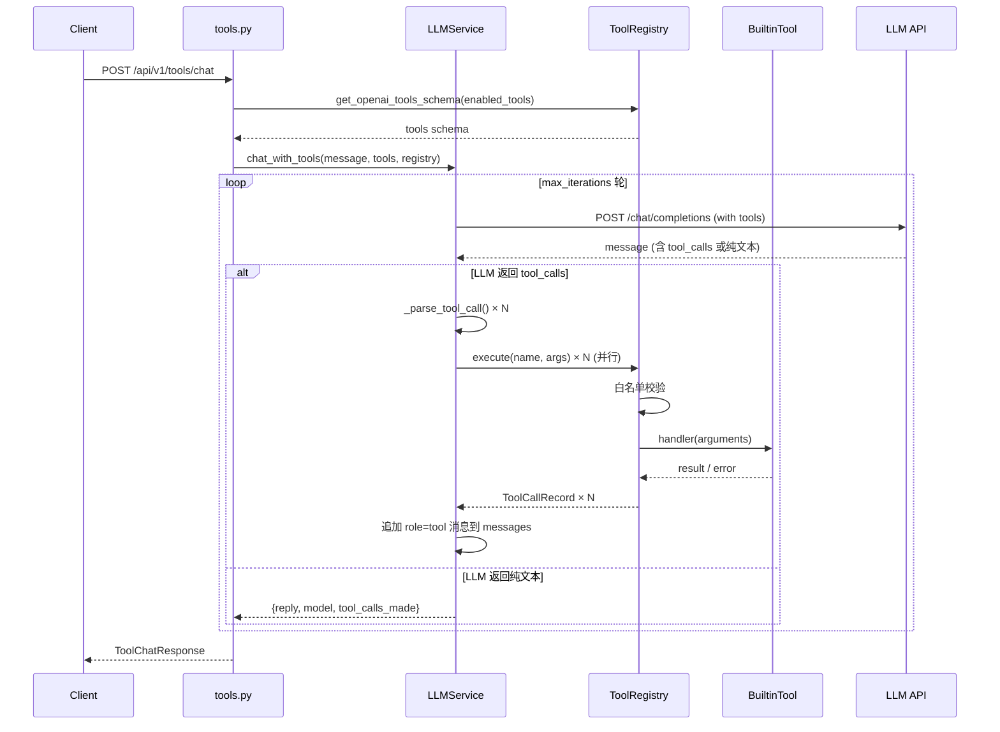
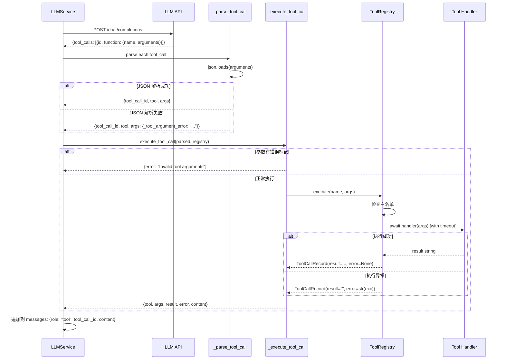
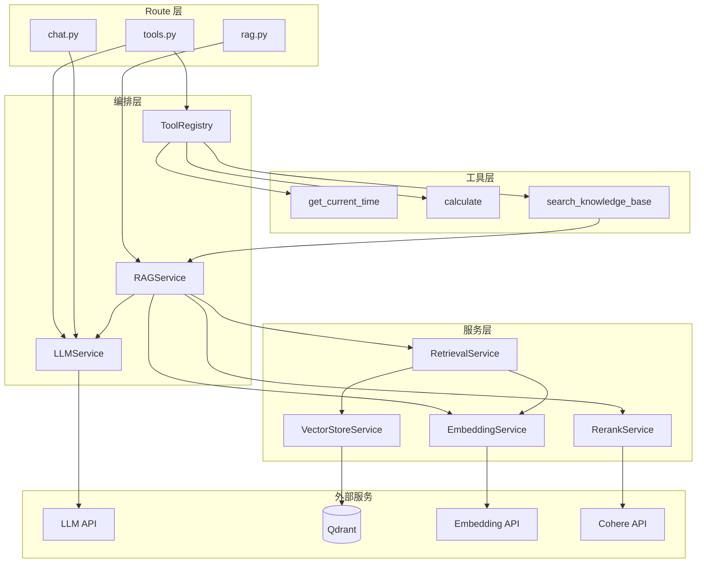
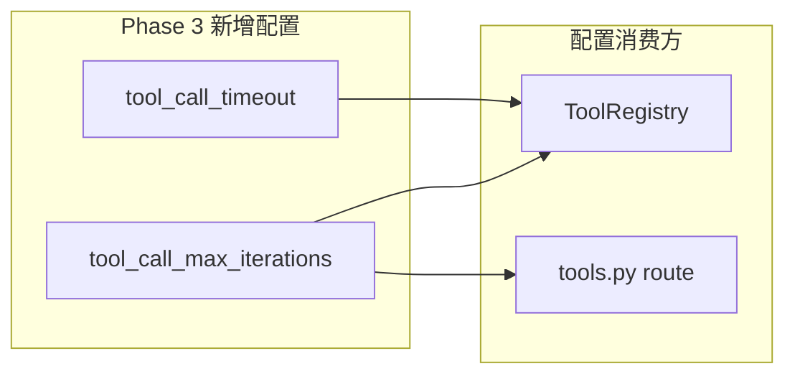
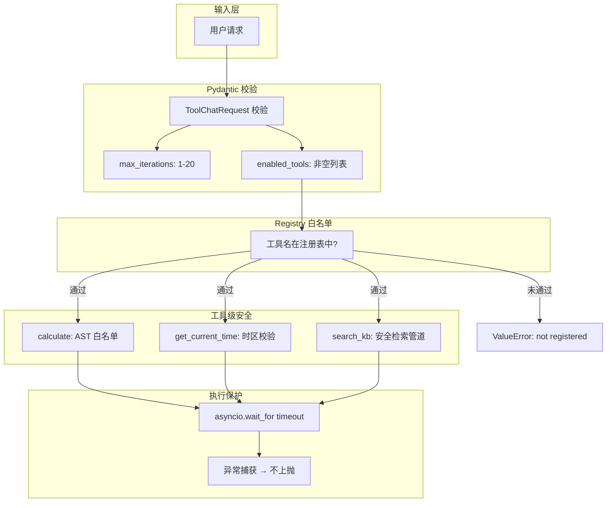

# Phase 3 Tool Use 架构文档

## 1. 系统目标

Phase 3 在 Phase 0+1+2 的基础上增加了 Tool Use / Function Calling 能力：

- LLM 可以动态选择并调用外部工具
- 支持多轮工具调用循环和并行工具执行
- 可扩展的工具注册表机制
- 3 个内置工具（时间查询、安全计算、知识库搜索）
- 完整的安全防护（白名单、超时、输入限制）

系统从"基于文档的问答后端"升级为"能调用外部工具的智能助手后端"。

## 2. Phase 3 架构概览

Phase 3 新增了以下层次：

- **Route 层**：新增 `tools.py`，2 个端点
- **Schema 层**：新增 `tools.py`，5 个数据模型
- **Service 层**：新增 ToolRegistry + 3 个内置工具，扩展 LLMService
- **无新外部依赖**：完全基于已有的 httpx + FastAPI 栈

## 3. 模块划分（Phase 3 新增 / 修改）

### 3.1 `app/schemas/tools.py`（新增）

职责：
- 定义 Tool 相关的所有请求/响应模型

模型清单：
- `ToolChatRequest`：工具对话请求（message + enabled_tools + max_iterations + system_prompt）
- `ToolCallRecord`：单次工具调用记录（tool + args + result + error）
- `ToolChatResponse`：工具对话响应（reply + model + tool_calls_made）
- `ToolInfo`：工具信息（name + description + parameters）
- `ToolListResponse`：工具列表响应

设计要点：
- `ToolChatRequest` 使用 `@model_validator` 校验 `enabled_tools` 非空列表
- `max_iterations` 有范围限制 `Field(ge=1, le=20)`
- `ToolCallRecord` 中 `error` 可选，正常执行时为 `None`

### 3.2 `app/services/tool_registry.py`（新增）

职责：
- 工具的注册、查询、Schema 转换、安全执行

核心类：
- `RegisteredTool`：不可变数据类（`frozen=True`），存储工具四元组
- `ToolRegistry`：注册表主类

关键方法：

| 方法 | 职责 |
|------|------|
| `register_tool()` | 向注册表添加工具 |
| `list_tools(enabled_tools)` | 按名称过滤已注册工具，校验未知工具名 |
| `get_openai_tools_schema()` | 转为 OpenAI API tools 格式 |
| `get_tool_infos()` | 转为 ToolInfo 列表（API 返回用）|
| `execute(name, args)` | 白名单校验 → 超时保护 → 执行 → 错误捕获 |

设计要点：
- 构造函数注入 `Settings` 和 `RAGService`，支持测试
- `_register_defaults()` 在初始化时注册 3 个内置工具
- `execute()` 中用 `asyncio.wait_for` 实现超时保护
- 工具执行异常不上抛，转为 `ToolCallRecord(error=str(exc))`

### 3.3 `app/services/tools/`（新增目录）

包含 3 个内置工具模块：

#### `get_current_time.py`

- 依赖：`zoneinfo`（Python 标准库）
- 输入：`timezone`（可选，默认 `Asia/Shanghai`）
- 输出：格式化时间字符串 `YYYY-MM-DD HH:MM:SS TZ`
- 错误处理：无效时区 → `ValueError`

#### `calculate.py`

- 依赖：`ast`、`math`（Python 标准库）
- 输入：`expression`（必填）
- 安全机制：
  - **不使用 eval()**
  - AST 白名单遍历：只允许 `Constant`、`BinOp`（+−×÷%**//）、`UnaryOp`（+−）、`Call`（sqrt/abs/round）
  - 表达式长度限制：200 字符
  - 指数绝对值限制：100
- 输出：计算结果字符串

#### `search_knowledge_base.py`

- 依赖：`RAGService`（Phase 2 编排器）
- 输入：`query`（必填）、`top_k`（可选，默认 3）、`document_id`（可选）
- 逻辑：调用 `rag_service.search()` → 格式化结果摘要（每条截断 200 字符）
- 输出：编号列表文本，或 "No knowledge base results found."

#### `__init__.py`

统一导出 3 个 `build_*_tool()` 工厂函数。

### 3.4 `app/services/llm_service.py`（修改）

新增方法：
- `chat_with_tools()`：工具调用循环主逻辑

重构方法：
- `_call_chat_api()` → `_call_chat_completion()`：返回完整 message dict（而非仅 content 字符串），支持 `tools` 参数

新增内部方法：
- `_assistant_message_to_payload()`：将 API 响应的 message 转为追加到 messages 的格式
- `_parse_tool_call()`：解析单个 tool_call，处理 JSON 解析错误
- `_execute_tool_call()`：执行单个工具调用，统一错误处理

设计要点：
- 构造函数新增 `settings` 参数注入（之前硬编码 `get_settings()`）
- `chat_with_tools` 中用 `asyncio.gather` 并行执行同一轮的多个 tool_calls
- `copy.deepcopy(messages)` 防止 payload 构建时修改原始 messages
- 工具参数 JSON 解析失败时，在 args 中标记 `_tool_argument_error`，不中断循环

### 3.5 `app/api/routes/tools.py`（新增）

职责：
- 暴露 2 个 Tool 端点

端点：
- `GET /api/v1/tools/list`：返回所有已注册工具的信息
- `POST /api/v1/tools/chat`：带工具的对话

设计要点：
- 模块级实例化 `llm_service` 和 `tool_registry`
- `ValueError` → 400，其他异常 → 500（不泄露内部信息）
- `enabled_tools` 校验在 Registry 层完成

### 3.6 `app/core/config.py`（修改）

新增配置项：
```python
tool_call_max_iterations: int = Field(default=10, ge=1)
tool_call_timeout: int = Field(default=30, gt=0)
```

### 3.7 `app/main.py`（修改）

新增 router 注册：
```python
from app.api.routes.tools import router as tools_router
app.include_router(tools_router)
```

## 4. 完整文件结构

```bash
8w-plan/
├─ app/
│  ├─ main.py                              # 应用入口（新增 tools_router）
│  ├─ api/routes/
│  │  ├─ health.py                         # Phase 0
│  │  ├─ chat.py                           # Phase 1
│  │  ├─ rag.py                            # Phase 2
│  │  └─ tools.py                          # Phase 3 ← 新增
│  ├─ core/
│  │  ├─ config.py                         # Phase 3 扩展（tool_call_*）
│  │  └─ logging.py
│  ├─ schemas/
│  │  ├─ chat.py                           # Phase 1
│  │  ├─ rag.py                            # Phase 2
│  │  └─ tools.py                          # Phase 3 ← 新增
│  └─ services/
│     ├─ prompt_service.py
│     ├─ llm_service.py                    # Phase 3 扩展（chat_with_tools）
│     ├─ tool_registry.py                  # Phase 3 ← 新增
│     ├─ tools/                            # Phase 3 ← 新增目录
│     │  ├─ __init__.py
│     │  ├─ get_current_time.py
│     │  ├─ calculate.py
│     │  └─ search_knowledge_base.py
│     ├─ document_parser_service.py        # Phase 2
│     ├─ chunking_service.py               # Phase 2
│     ├─ embedding_service.py              # Phase 2
│     ├─ vector_store_service.py           # Phase 2
│     ├─ retrieval_service.py              # Phase 2
│     ├─ rerank_service.py                 # Phase 2
│     ├─ rag_service.py                    # Phase 2
│     └─ evaluation_service.py             # Phase 2
├─ tests/
│  ├─ test_health.py                       # Phase 0
│  ├─ test_extract.py                      # Phase 1
│  ├─ test_document_parser_service.py      # Phase 2
│  ├─ test_chunking_service.py             # Phase 2
│  ├─ test_embedding_service.py            # Phase 2
│  ├─ test_retrieval_service.py            # Phase 2
│  ├─ test_rerank_service.py               # Phase 2
│  ├─ test_rag_service.py                  # Phase 2
│  ├─ test_rag_endpoints.py                # Phase 2
│  ├─ test_settings_rag.py                 # Phase 2
│  ├─ test_evaluation_service.py           # Phase 2
│  ├─ test_tool_registry.py                # Phase 3 ← 新增
│  ├─ test_tools_builtin.py                # Phase 3 ← 新增
│  ├─ test_tool_calling_loop.py            # Phase 3 ← 新增
│  └─ test_tools_endpoint.py               # Phase 3 ← 新增
└─ ...
```

## 5. 数据流 / 调用链

### 5.1 Tool Chat（工具对话）调用链



### 5.2 单轮工具调用详细流程



## 6. 服务依赖关系



**关键依赖路径**：
- `tools.py → ToolRegistry → search_knowledge_base → RAGService → ...（Phase 2 全链路）`
- `tools.py → LLMService → LLM API`
- `time_tool / calc_tool`：无外部依赖，纯本地计算

## 7. 配置依赖关系

Phase 3 在 `Settings` 中新增的配置：



- `tool_call_max_iterations`：由 Route 层读取作为默认值，API 请求可覆盖
- `tool_call_timeout`：由 ToolRegistry 在 `execute()` 中用于 `asyncio.wait_for`

## 8. 安全架构



## 9. 与 Phase 2 的架构关系

Phase 3 没有修改 Phase 2 的任何服务，而是通过 `search_knowledge_base` 工具桥接：

```
Phase 2（确定性流水线）：
  用户 → /rag/search → Retrieval → Rerank → 结果

Phase 3（LLM 驱动决策）：
  用户 → /tools/chat → LLM 决策 → [可能调 search_kb] → Retrieval → Rerank → 结果 → LLM 整合回答
```

Phase 2 的 RAG 端点仍然独立可用。Phase 3 只是多了一种"间接使用 RAG"的方式。

## 10. 测试架构

| 测试文件 | 测试目标 | 用例数 | Mock 策略 |
|----------|----------|--------|-----------|
| `test_tool_registry.py` | 注册表核心功能 | 4 | FakeRAGService |
| `test_tools_builtin.py` | 3 个内置工具 | 7 | FakeRAGService |
| `test_tool_calling_loop.py` | 工具调用循环 | 4 | Mock httpx + 真实 Registry |
| `test_tools_endpoint.py` | API 端点集成 | 4 | Mock LLMService.chat_with_tools |
| **合计** | | **19** | |

加上 Phase 0+1+2 的 84 个测试，项目总计 **103 个测试**。
